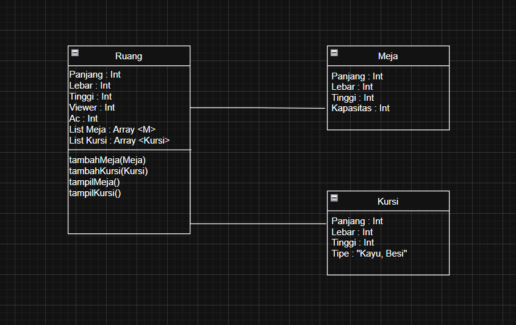

# Ruangan (Kotlin)

Sistem ini memodelkan **ruangan** beserta **meja** dan **kursi** menggunakan prinsip **Object-Oriented Programming (OOP)** di Kotlin. Project ini cocok untuk simulasi pengelolaan ruang belajar, kantor, atau auditorium.  

## Fitur Utama
- Menambahkan **meja** ke dalam ruangan  
- Menambahkan **kursi** ke dalam ruangan  
- Menampilkan daftar **meja** yang tersedia  
- Menampilkan daftar **kursi** yang tersedia  

## Struktur Kelas
| Kelas | Deskripsi |
|-------|-----------|
| `Meja` | Merepresentasikan meja, dengan atribut: `id`, `panjang`, `lebar`, `tinggi`, `kapasitas`. |
| `Kursi` | Merepresentasikan kursi, dengan atribut: `id`, `panjang`, `lebar`, `tinggi`, `tipe`. |
| `Ruang` | Menyimpan daftar meja & kursi serta atribut tambahan ruangan: `panjang`, `lebar`, `tinggi`, `jumlah viewer`, `AC`. |

## UML Diagram
Berikut diagram UML dari project:

